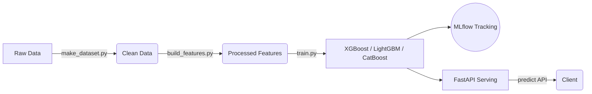

# Cap: End-to-End Telco Churn Prediction Pipeline [](https://github.com/PabloFerrerGonzalez333/cap/actions/workflows/ci.yml)

An **end-to-end Data Science & MLOps pipeline** designed to predict customer churn using the IBM Telco Customer dataset. This repository demonstrates a complete machine learning lifecycle, focusing on reproducibility, clean code, and production-ready serving.

### 🌟 Business Value
Customer churn prediction is highly critical for telecommunications companies. By accurately forecasting which clients are at risk of leaving, companies can proactively target them with retention strategies, saving significant revenue. This project encapsulates the entire workflow required to train a robust model and expose it as a scalable API. 

> **Technologies Used:** Python · Poetry · Uvicorn/FastAPI (Serving) · MLflow (Tracking) · Sphinx (Documentation)

## 🏗 Architecture & Workflow



---

## 📦 Requirements

- **Python 3.12** (recommended)
- **Poetry** for environment and dependency management

---

## 🚀 Installation & Setup

Clone the repository and install the dependencies:

```bash
pip install poetry
poetry install
```

> This will create an isolated virtual environment and automatically download all the dependencies defined in `pyproject.toml`.

---

## 🧭 Project Structure

```text
.
├── README.md                # Project description
├── pyproject.toml           # Poetry dependencies configuration
├── notebooks/               # Jupyter notebooks (EDA, features, models, tracking)
│   ├── 01_eda.ipynb         # Exploratory Data Analysis (EDA)
│   ├── 02_features.ipynb    # Feature creation and transformation
│   ├── 03_models.ipynb      # Model training and validation
│   └── 04_mlflow.ipynb      # Experiment tracking with MLflow
├── reports/                 # Rendered HTML results and figures
├── docs/                    # Sphinx generated documentation
├── src/                     # Main source code
│   ├── data/
│   │   └── make_dataset.py        # Data downloading and cleaning
│   ├── features/
│   │   ├── build_features.py      # Feature engineering and preparation
│   │   └── feature_selection.py   # Feature selection methods
│   ├── models/
│   │   ├── models.py              # Classifiers definition and hyperparameter grids
│   │   ├── train.py               # Nested CV training and artifact saving
│   │   └── predict.py             # Batch predictions with trained models
│   └── serving/
│       └── app.py                 # Prediction API (FastAPI)
```

### Module Descriptions

- **`src/data/make_dataset.py`**: Downloads, cleans, and transforms raw data to prepare it for modeling.
- **`src/features/build_features.py`**: Handles feature engineering, encoding, scaling, and splitting data.
- **`src/features/feature_selection.py`**: Utilities for variable selection (variance, correlation, collinearity, RFECV).
- **`src/models/models.py`**: Defines available classifiers and their hyperparameter grids.
- **`src/models/train.py`**: Trains models with nested cross-validation, selects the optimal threshold, and persists artifacts.
- **`src/models/predict.py`**: Generates batch predictions from a saved model.
- **`src/serving/app.py`**: FastAPI application exposing the production models via REST endpoints.

---

## ⚡️ Quick Start Guide (TL;DR)

1. **Install Dependencies**
   ```bash
   poetry install
   ```

2. **Generate Documentation**
   - **Windows:** `.\docs\make.bat html`
   - **Linux/macOS:** `make -C docs html`

3. **Download 'Telco Churn' Data**
   ```bash
   poetry run python src/data/make_dataset.py --out data/raw/telco.csv
   ```

4. **Data Preparation**
   ```bash
   poetry run python src/features/build_features.py --in data/preprocessed/telco_preprocessed.xlsx --out data/processed --kind cc
   ```

5. **Train, Evaluate, and Save Model**
   ```bash
   poetry run python src/models/train.py --data data/processed --models models
   ```
   > *Note: This script may take up to an hour to execute. It will save the trained model and testing metrics. *

6. **Serve the API**
   ```bash
   poetry run uvicorn src.serving.app:app --host 127.0.0.1 --port 8000
   ```
   - Documentation is available at: `GET http://localhost:8000/documentation`
   - *Note: In production repo this is exposed via Github Pages.*

7. **Example Prediction Request**
   ```bash
   curl -X POST http://127.0.0.1:8000/predict -H "Content-Type: application/json" --data @sample.json
   ```

## 📊 MLflow Tracking

To view the experiment logs and interactive UI:
```bash
poetry run mlflow ui
```
> After starting the server, run the `04_mlflow.ipynb` notebook to log the experiments.
